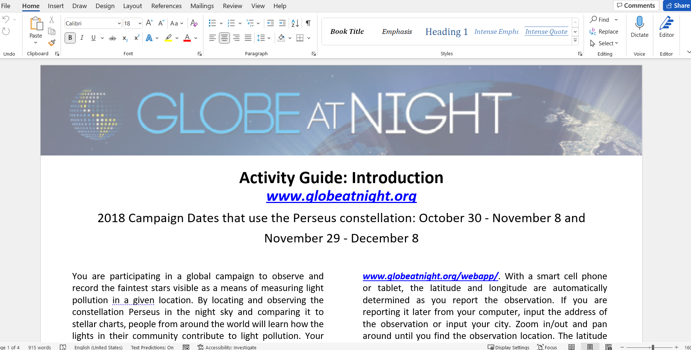

# GaN (Globe at Nigth) Activity Guides Generator

## Table of contents
- [GaN (Globe at Nigth) Activity Guides Generator](#gan-globe-at-nigth-activity-guides-generator)
  - [Table of contents](#table-of-contents)
  - [Description](#description)
  - [Languages](#languages)
  - [Constellations:](#constellations)
    - [Northern Hemisphere:](#northern-hemisphere)
    - [Southern Hemisphere:](#southern-hemisphere)
- [Technologies](#technologies)
  - [How it works](#how-it-works)
  - [Sources](#sources)
  - [Screenshots](#screenshots)
  - [Special thanks](#special-thanks)
  - [Project status](#project-status)
  - [Contact](#contact)

## Description

Welcome. This software makes it possible to create several Activity guides for the Globe at Night campaign, a worldwide citizen science movement, in multiple languages. Users can measure and report their observations of the night sky brightness thanks to the Activity instructions that will be accessible in PDF format for the constellations.

## Languages

The 20 Languages for the GaN Activity guide are:
* Catalan
* Chinese (Traditional)
* Czech
* English
* Finnish
* French
* Galician
* German
* Greek
* Indonesian
* Japanese
* Polish
* Portuguese
* Romanian
* Serbian
* Slovak
* Slovenian
* Spanish
* Swedish
* Thai

## Constellations:

### Northern Hemisphere:
* Bootes
* Cygnus
* Gemini
* Hercules
* Leo
* Orion
* Pegasus
* Perseus
* Taurus

### Southern Hemisphere:
* Bootes
* Canis Major
* Crux
* Grus
* Hercules
* Leo
* Orion
* Pegasus
* Perseus
* Sagittarius
* Scorpius
* Taurus

# Technologies
* MS Word
* MS Excel
* Python 3:
    * os
    * time
    * sys
    * deeep_translator
    * python-docx
    * pandas
    * shutil
    * multiprocessing
    * BeautifulSoup
    * Requests
    * Datetime

The charts are taken from the website "https://www.globeatnight.org/magcharts"

## How it works 
1. The constellations and the observation dates must be created, edited and saved in the excel file: Gan_cons_and_dates.xlsx
    a. The Constellation's names must be introduced Capitalize and without blank spaces except for " Canis Major"(which must be inserted like this)
    b. The month's names must be introduced completely without symbols like "." , "-" etc...
    c. The dates must be introduced in number format without symbols like "." , "-" etc... 
2. The Activity Guides changes should be edited in the word files for each language, by opening each file and save the changes.
    a. Do not change the headers that contents the Constellation's names and the dates.
    b. Do note change the first paragraph of the Activity Guide
3. While runnig the program, the different aActivity guides for the selected contellations and languages will be created like .docx and saved in PDF  format. At the end of the execution the word files will be removed.

## Sources
* Python docx documentation: https://python-docx.readthedocs.io/en/latest/
* Platzi: https://platzi.com/cursos/webscraping/
* Elliot Kisiel: https://github.com/NOAO-dark-sky/GaN
* The charts are taken from the website "https://www.globeatnight.org/magcharts"

## Screenshots

## Special thanks

I want to especially thank Javier Enciso, Juan David Vargas and the Enciso Systems team.

## Project status

Now working on the GUI hoping a great outcome with flakwebgui (last actualization 07-25-2022)

## Contact

Created by Marco Moreno - feel free to contact me! 
marco.datadev@gmail.com
