# GaN (Globe at Nigth) Activity Guides Generator

## Table of contents
- [GaN (Globe at Nigth) Activity Guides Generator](#gan-globe-at-nigth-activity-guides-generator)
  - [Table of contents](#table-of-contents)
  - [Description](#description)
  - [Languages](#languages)
  - [Constellations:](#constellations)
    - [Northern Hemisphere:](#northern-hemisphere)
    - [Southern Hemisphere:](#southern-hemisphere)
  - [Technologies](#technologies)
  - [Requirements](#requirements)
  - [How it works](#how-it-works)
  - [Sources](#sources)
  - [Screenshots](#screenshots)
  - [Special thanks](#special-thanks)
  - [Project status](#project-status)
  - [Contact](#contact)

## Description

Welcome. This software makes it possible to create several Activity guides for the Globe at Night campaign, a worldwide citizen science movement, in multiple languages. Users can measure and report their observations of the night sky brightness thanks to the Activity instructions that will be accessible in PDF format for the constellations.
https://www.globeatnight.org/

## Languages

The 20 Languages for the GaN Activity guides are:
* Catalan
* Chinese (Traditional)
* Czech
* English
* Finnish
* French
* Galician
* German
* Greek
* Indonesian
* Japanese
* Polish
* Portuguese
* Romanian
* Serbian
* Slovak
* Slovenian
* Spanish
* Swedish
* Thai

## Constellations:

### Northern Hemisphere:
* Bootes
* Cygnus
* Hercules
* Leo
* Orion
* Pegasus
* Perseus

### Southern Hemisphere:
* Bootes
* Canis Major
* Crux
* Grus
* Hercules
* Leo
* Orion
* Pegasus
* Sagittarius
* Scorpius

## Technologies
* MS Word
* MS Excel
  
* Python 3 (Included):
    * os
    * time
    * sys
    * shutil
    * multiprocessing
    * Requests
    * Datetime

* Python 3 (Install):
  * deep_translator
  * python-docx
  * pandas
  * BeautifulSoup
  * Requests
  * comtypes
  
* Flask:
  * flask_wtf
  * wtforms
  * flaskwebgui

The charts are taken from the website "https://www.globeatnight.org/magcharts"

## Requirements
* Windows 8 or later.
* Internet connection.
* Python 3.6 or later.
* MSOffice 2016 or later (.docx and .xlsx).
* Python 3 (Install):
  * deep_translator
  * python-docx
  * pandas
  * BeautifulSoup
  * Requests
  * Flask
  * flask_wtf
  * wtforms
  * flaskwebgui
  * Flask-Bootstrap
  * comtypes

## How it works 
1. Install python, you can download it from: https://www.python.org/downloads/
   
2. Download the application from https://github.com/marcoh3mmm/GaN
   
3. In the folder where you have cloned the repository or downloaded it, use the command prompt to execute "pip install -r requirements.txt"
  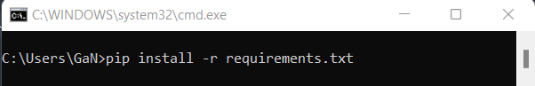

3. In the folder where you have cloned the repository or downloaded it, use the command prompt to execute "python main.py" 
  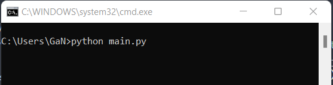

2. Then, the app will be opened in the following screen:
   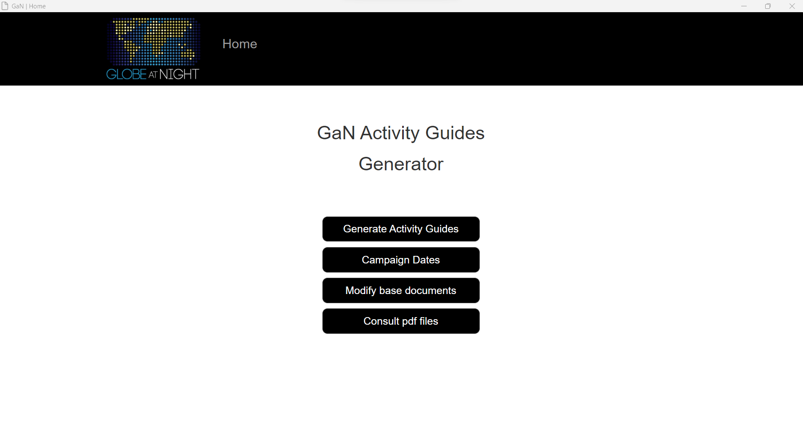

3. the 5 Button functionalities:
   1. Generate Activity Guides: Go to the Selections page to generate the Activity guides.
   2. Edit Campaign Dates: Open the .xlsx file to change the constellations dates
   3. Edit Base Documents: Go to the folder that contains the .docx original files.
   4. Browse pdf Files: Go to the folder where the .pdf files you created are located.
   5. About: information about the application's development.
   
4. Press the Button "Generate Activity Guides" to see the following page: 
   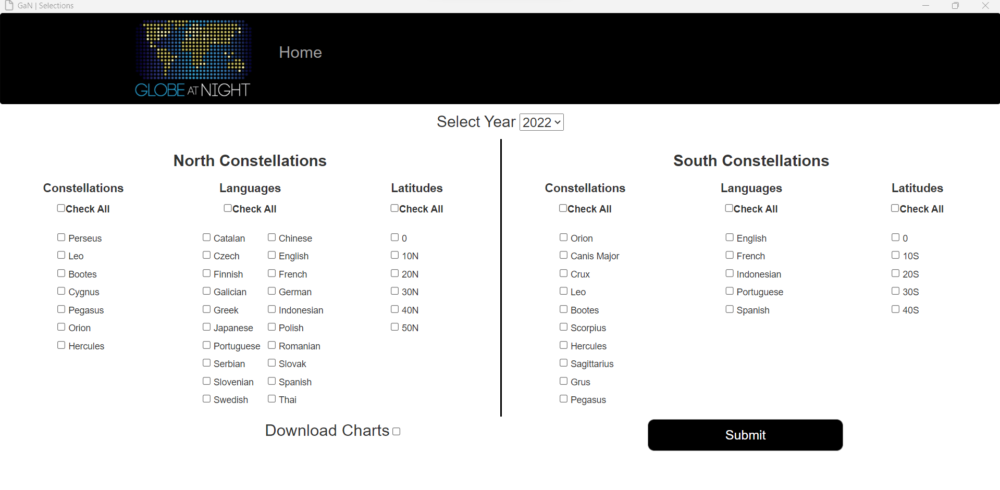

   1. Valid Entries: at least one checkbox must be checked on "Constellations", "Languages", and "Latitudes" for North or South constellations.
      1. Hint1: You can generate Activity Guides only for north Constellations, without checking any boxes on the south Constellations.
      2. Hint2: You can generate Activity Guides only for south Constellations, without checking any boxes on the north Constellations.
    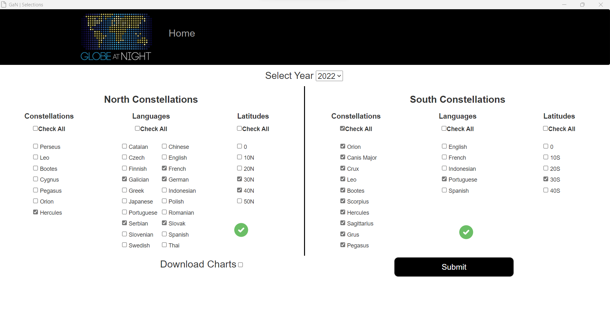
    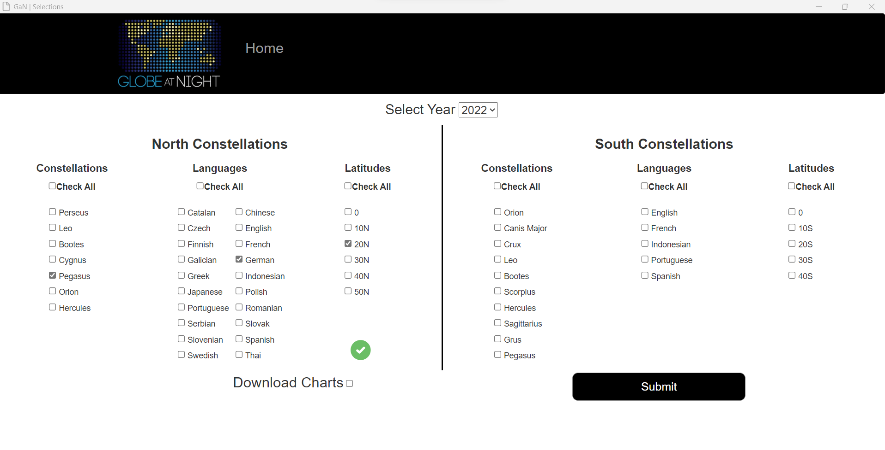
   2. Avoid doing this:
    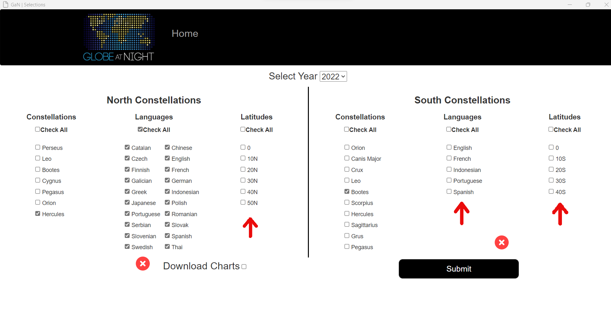
    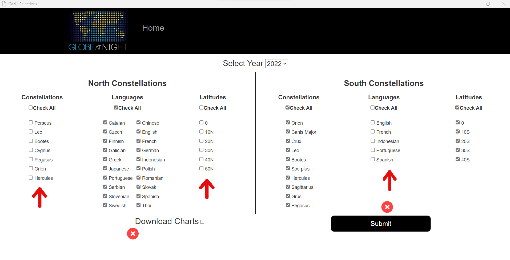

   3. You can change the year by clicking on "Select Year".

   4. If The "Download Charts" box is checked, you will obtain the latest magnitudes charts from the website:
   Note: It will take a few more time to generate the activity guides.

   1. Now press "Submit" Button, and finally the folder with the new Activity Guides will be opened.
  
5.  Press the Button "Edit Campaign Dates" and the .xlsx file will be opened:
    1.  Please don't change the names of the constellations.
    2.  The months' names must be introduced completely without symbols.
    3.  The dates must be introduced in number format using only "-" to indicate a period of time.
  

6. Press the Button "Edit Base Documents" and the folder with the .docx files will be opened:
   1. Please don't change the headers where the dates are on any of the pages.
   2. Don't change the first paragraph.
   3. Don't edit the Charts.
    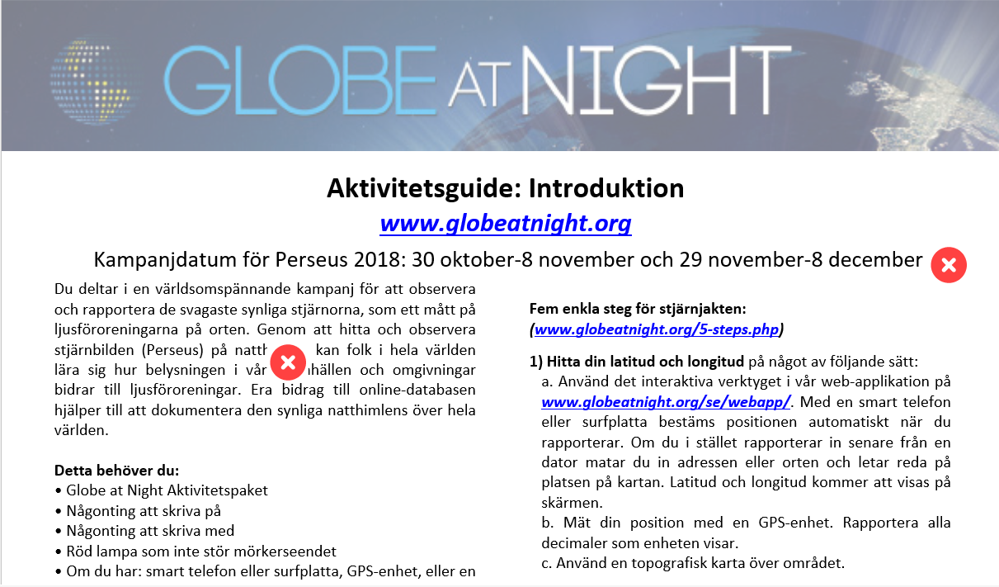
    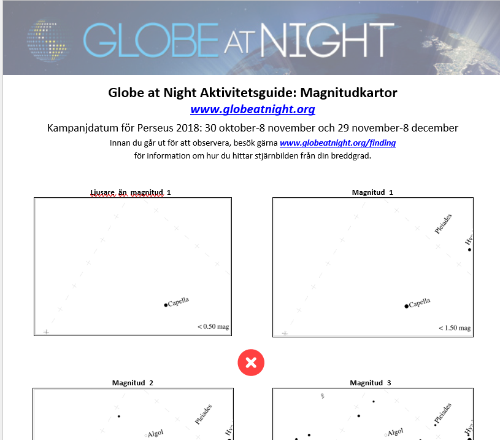
  
7. Press the Button "Browse pdf Files" and the folder with the .pdf files will be opened:
   1. Each folder has two numbers: one is the date and the other is the hour when the folder has been created.
   2. Each folder is unique.
   3. You can remove all the created folders , but not the "pdf_files" folder.
    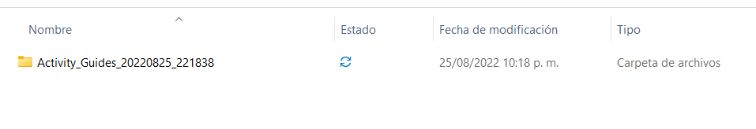
  
8. Inactivity:
    After 5 minutes it will close automatically, just execute python main.py from the command promt.
  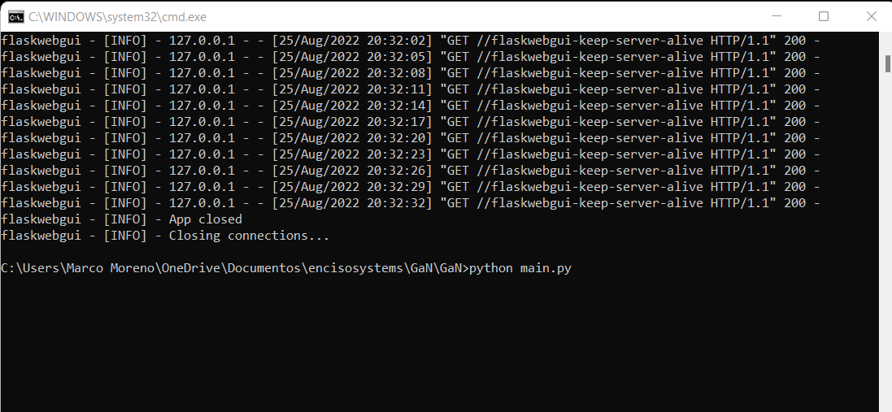

9.  **Warning:**
    Close the .xlsx file, and all the .docx files before submitting the form.
  

## Sources
* Python docx documentation: https://python-docx.readthedocs.io/en/latest/
* Platzi: https://platzi.com/cursos/webscraping/
* Elliot Kisiel: https://github.com/NOAO-dark-sky/GaN
* The charts are taken from the website "https://www.globeatnight.org/magcharts"

## Screenshots

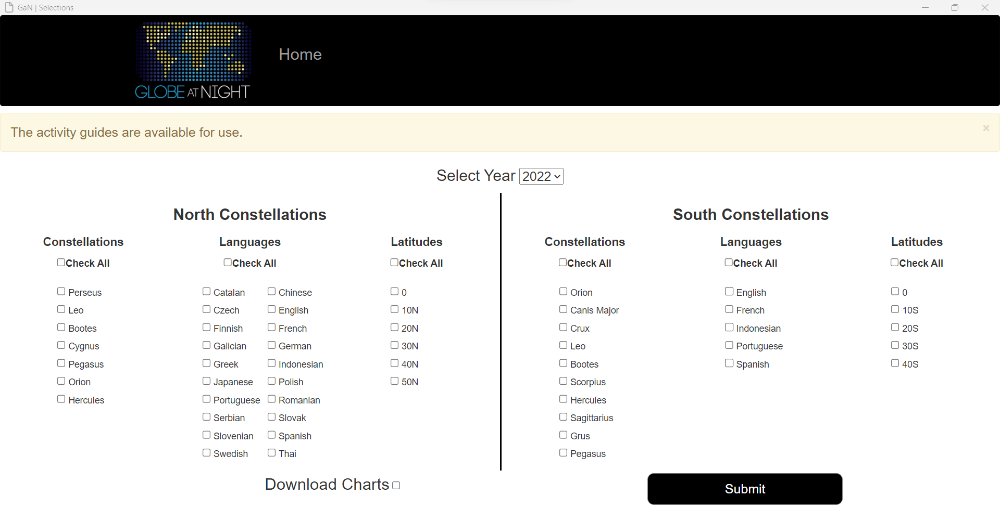

## Special thanks

I want to especially thank Connie Walker, Mark Newhose, Elliot Krisiel, Javier Enciso, Juan David Vargas, Alejandro Vivas, and the Noirlab and Enciso Systems teams.

## Project status

Now working on the Installers (last actualization 08-25-2022)

## Contact

Created by Marco Moreno - feel free to contact me! 
marco.datadev@gmail.com

